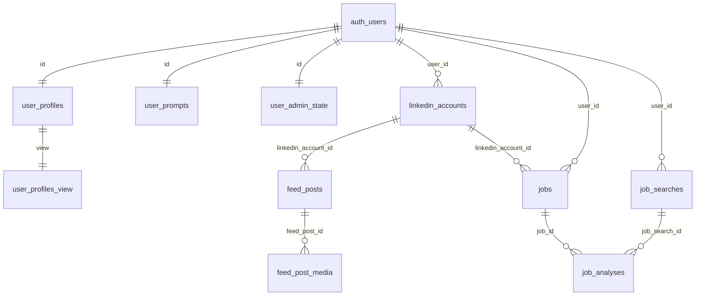
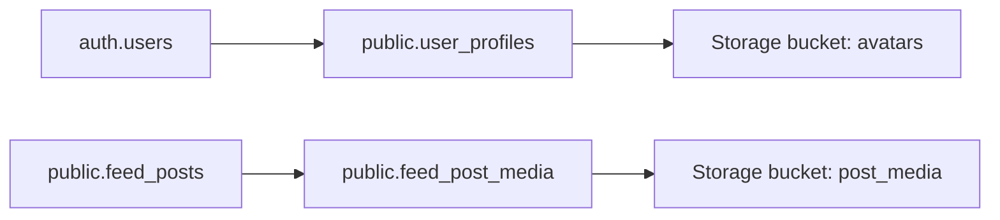

# Схема БД Pulse Reader (Supabase) — на русском

Источник правды — SQL‑миграции в `worker/supabase/migrations/*.sql`. Схема эволюционная: итоговый набор колонок зависит от того, какие миграции применены в Supabase (SQL Editor).

## Общая карта связей

### Связи с Supabase Storage (файлы)

## 1) Пользователь и настройки

### `auth.users` (Supabase Auth)
Системная таблица Supabase. Мы её не меняем. Главная сущность — `id` (uuid).

### `public.user_profiles` — профиль пользователя (человекочитаемые поля)
Миграции:
- `20260805180000_create_user_profiles.sql`
- `20260827110000_split_user_profiles.sql`
- `20260905210000_user_profiles_locale.sql`

Поля: `id`, `full_name`, `phone`, `avatar_url`, `company`, `job_title`, `date_of_birth`, `city`, `bio`, `website`, `locale`, `created_at`, `updated_at`.
Связь 1:1 с `auth.users` по `id`.

### `public.user_prompts` — промпты для LLM
Миграция: `20260827110000_split_user_profiles.sql`

Поля: `id`, `search_prompt`, `comment_prompt`, `created_at`, `updated_at`.

### `public.user_admin_state` — админ/блокировки/счётчики
Миграция: `20260827110000_split_user_profiles.sql` (до split это было в таблице профиля через `20260827090000_admin_user_profiles.sql`)

Поля: `id`, `is_admin`, `is_blocked`, `blocked_at`, `post_search_run_count`, `created_at`, `updated_at`.

### `public.user_profiles_view` — view для чтения “всё в одном”
Миграции: `20260827110000_split_user_profiles.sql`, `20260905210000_user_profiles_locale.sql`

Объединяет `user_profiles` + `user_prompts` + `user_admin_state`.

## 2) LinkedIn аккаунты и посты

### `public.linkedin_accounts` — LinkedIn‑аккаунт/сессия внутри Pulse
Миграции:
- `20260510221600_create_linkedin_accounts_and_feed_posts.sql`
- `20260904150000_linkedin_accounts_session_snapshot.sql`

Поля: `id`, `user_id`, `label`, `li_profile_url`, `cookies_json`, `cookies_updated_at`, `session_snapshot`, `created_at`, `updated_at`.
Связь: `user_id -> auth.users.id`.

### `public.feed_posts` — собранные посты + состояние анализа
Миграция: `20260510221600_create_linkedin_accounts_and_feed_posts.sql`
Связь: `linkedin_account_id -> linkedin_accounts.id`.

Ключевые поля: `source_key`, `urn`, `post_url`, `author_json`, `content`, `published_at_text`,
`reactions_count`, `comments_count`, `media_urls`, `raw_extra`,
`is_relevant`, `comment_text`, `analysis_error`, `analysis_payload`,
`fetched_at`, `analyzed_at`.

### `public.feed_post_media` — метаданные сохранённых картинок поста
Миграция: `20260826140300_feed_post_media_storage.sql`
Связь: `feed_post_id -> feed_posts.id` (cascade delete).

Поля: `original_url`, `object_path`, `public_url`, `position`, `created_at`.

## 3) Поиск вакансий

### `public.job_searches` — сохранённые поиски вакансий (конфиг)
Миграции:
- `20260912210000_job_search_tables.sql`
- `20260913180000_job_searches_linkedin_filters.sql` (добавляет `linkedin_filters`)

Поля: `id`, `user_id`, `title`, `search_query`, `location`, `filter_prompt`, `status`, `last_run_at`, `linkedin_filters`, `created_at`, `updated_at`.
Связь: `user_id -> auth.users.id`.

### `public.jobs` — вакансии (дедуп и хранение содержимого)
Миграция: `20260912210000_job_search_tables.sql`
Связи: `user_id -> auth.users.id`, `linkedin_account_id -> linkedin_accounts.id`.

Ключевые поля: `source_key`, `linkedin_job_id`, `job_url`, `title`, `company`, `location`, `description`, `raw_extra`, `fetched_at`.

### `public.job_analyses` — результат AI‑анализа вакансии для конкретного поиска
Миграция: `20260912210000_job_search_tables.sql`
Связи: `job_search_id -> job_searches.id`, `job_id -> jobs.id`.

Ключевые поля: `match`, `score`, `reason`, `matched_requirements`, `missing_requirements`, `red_flags`, `raw_payload`, `error`, `analyzed_at`.
Уникальность: `(job_search_id, job_id)`.

## 4) Supabase Storage (файлы)

### Bucket `post_media`
Миграция: `20260826140300_feed_post_media_storage.sql`
Путь: `post_media/{user_id}/{feed_post_id}/{position}.{ext}`

### Bucket `avatars`
Миграции: `20260827130000_avatars_storage.sql` и/или `20260805180100_avatars_storage_policies.sql`
Путь: `avatars/{user_id}/avatar.{ext}`

## 5) RLS (кратко)
RLS включён в ключевых таблицах. Пользователь видит только свои данные (обычно `user_id = auth.uid()` или через цепочку связей). Worker с `service_role` ключом обходит RLS.

