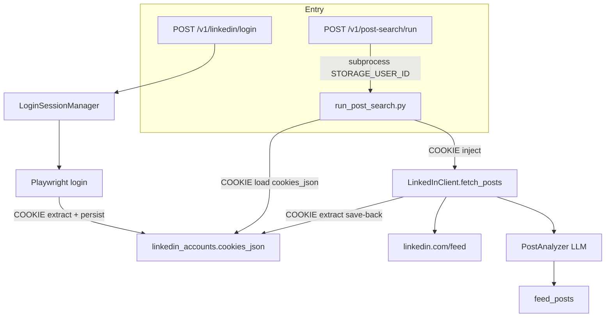

# Pulse Reader worker: текущий алгоритм и точки интеграции cookies

Документ для другой модели / другой разработки.
Цель: описать, что уже есть в LinkedIn Pulse Reader (только worker), где сейчас трогаются cookies, и куда в этот алгоритм встраивается новый модуль работы с сессией (session snapshot).

Новый модуль живёт на стороне другой разработки. Контракт и инварианты — `worker/linbox/GOLD.md` и `worker/linbox/PROMPT.md`.
Пакет, который ожидаем на входе в Pulse: `session_snapshot` (Chrome MV3 snapshot → Playwright restore/export).

Не менять без явного решения: поиск постов, LLM-анализ, схему `feed_posts`, UI.

Маркеры:
- `[COOKIE]` — текущее обращение к cookies
- `[INTEGRATE]` — куда встраивать новый модуль

---

## 1. Что есть сейчас (worker only)

Репозиторий: LinkedIn Pulse Reader v.3. Worker — Python.

| Слой | Путь | Роль |
|---|---|---|
| Orchestration CLI | `worker/run_post_search.py` | логин при необходимости, fetch ленты, upsert постов, LLM |
| HTTP API | `worker/api/src/pulse_api/` | FastAPI: LinkedIn login + запуск поиска |
| LinkedInClient | `worker/LinkedInClient/` | Playwright. Cookies **не хранит**, только inject/extract |
| Storage | `worker/Storage/` | Supabase: `linkedin_accounts`, `feed_posts` |
| PostAnalyzer | `worker/PostAnalyzer/` | LLM-отбор постов и черновик комментария |

Точки входа:
1. CLI: `python worker/run_post_search.py --limit N`
2. API поиска: `POST /v1/post-search/run` → subprocess того же CLI, env `STORAGE_USER_ID`
3. API логина: `POST /v1/linkedin/login` → Playwright UI login → persist cookies

Пользователь приложения = `auth.users.id` (`STORAGE_USER_ID` / JWT).
Одна LinkedIn-сессия = одна строка `public.linkedin_accounts`.



### Алгоритм поиска (сейчас)

1. Взять `user_id`, опционально `label`.
2. `linkedin_accounts.list_by_user`.
3. Выбрать строку по `label`, иначе первую.
4. Если нет строки / пустой `cookies_json` → интерактивный логин → create/update.
5. `LinkedInClient(cookies=playwright_list)` → `fetch_posts`.
6. После сбора: `get_cookies()` → save-back в ту же строку.
7. Upsert `feed_posts`, медиа, LLM-анализ.
8. При `LoginRequiredError` — один retry с новым логином.

Cookies на поиск **не влияют** после шага 6. Анализ идёт по сохранённым постам.

---

## 2. Где хранятся cookies СЕЙЧАС

### Источник истины

Таблица Supabase `public.linkedin_accounts`, колонка `cookies_json jsonb`.

Миграция: `worker/supabase/migrations/20260510221600_create_linkedin_accounts_and_feed_posts.sql`

Поля:
- `id` uuid
- `user_id` → `auth.users.id`
- `label` text (несколько сессий на пользователя)
- `li_profile_url`
- `cookies_json` jsonb NOT NULL  — **массив Playwright cookie objects**
- `cookies_updated_at`

Формат элемента СЕЙЧАС (Playwright, не Chrome):
`name`, `value`, обязательно `domain` или `url`, плюс обычно `path`, `expires`, `httpOnly`, `secure`, `sameSite`.

Нет: localStorage, sessionStorage, userAgent, viewport, Chrome `expirationDate` / `sameSite: no_restriction`.

Репозиторий: `worker/Storage/src/storage/domain/pulse/linkedin_accounts.py`
- `list_by_user`
- `create(..., cookies_json=...)`
- `update_cookies(account_id, cookies_json)`

Worker ходит service role. RLS: пользователь видит только свои строки.

### Не источник истины

| Место | Зачем |
|---|---|
| `worker/.playwright-profile/` | persistent Chrome для Google/Apple login API |
| `LinkedInClient/run/cookies.json` | демо CLI библиотеки, Pulse search это не читает |
| RAM login/search sessions | только статус, не cookies |

Frontend cookies не хранит.

---

## 3. Карта обращений к cookies `[COOKIE]`

Это все места, где Pulse реально трогает cookies. Новый модуль должен заменить/обернуть именно их, а не парсинг ленты и не LLM.

### 3.1 Граница библиотеки (ядро inject/extract)

Файл: `worker/LinkedInClient/src/linkedin_client/auth/cookies.py`

| Функция | Что делает |
|---|---|
| `[COOKIE] validate_cookies` | name+value; domain или url |
| `[COOKIE] inject_cookies` | `context.add_cookies(list)` — восстановление сессии |
| `[COOKIE] extract_cookies` | `context.cookies()` — снимок для persist |

**[INTEGRATE-1]** Заменить пару inject/extract (или обернуть) API нового модуля:
- restore: `to_playwright_cookies` + `restore_session` (порядок GOLD: add_cookies → goto origin commit → apply_storage_snapshot)
- export: `from_playwright_cookies` + `export_session` / `merge_snapshot`
Сейчас inject — тупой `add_cookies` без origin goto и без localStorage.

Файл: `worker/LinkedInClient/src/linkedin_client/client.py`

| Место | Что делает |
|---|---|
| `[COOKIE] __enter__` ~L269 | если переданы cookies → `inject_cookies`; иначе открывает `/login` |
| `[COOKIE] login_and_get_cookies` | UI login, затем `extract_cookies` |
| `[COOKIE] get_cookies` | `extract_cookies` для save-back |

**[INTEGRATE-2]** `__enter__`: если вход — полный snapshot, не сырой Playwright list:
создать context с UA/viewport/locale из snapshot, затем `restore_session`, затем caller `goto(feed)`.
Не вызывать старый `inject_cookies` для snapshot-пути.

**[INTEGRATE-3]** `get_cookies` / конец login: возвращать не только cookie list, а snapshot (cookies Chrome-shape + storage + tab). Либо оставить list внутри клиента, а snapshot собирать снаружи через `export_session`.

### 3.2 Загрузка и save-back в оркестраторе поиска

Файл: `worker/run_post_search.py`

| Место | Что делает |
|---|---|
| `[COOKIE] login_and_get_cookies()` ~L358 | CLI fallback: Playwright login, вернуть list |
| `[COOKIE] fetch_and_store_posts` ~L378-381 | `LinkedInClient(cookies=cookies)` → fetch → `get_cookies()` → `accounts.update_cookies` |
| `[COOKIE] main` ~L627-643 | load `chosen["cookies_json"]`; пусто → login → create/update |
| `[COOKIE] LoginRequiredError` ~L654-663 | re-login, повтор fetch |

**[INTEGRATE-4] LOAD.** Сейчас читается `cookies_json` как `list[dict]`.
Нужно: читать snapshot (или cookies_json + отдельное storage-поле). Если в БД старый list — адаптер list→минимальный snapshot.

**[INTEGRATE-5] RESTORE.** Передача в `LinkedInClient` не сырого list, а snapshot. Клиент/обёртка вызывает `restore_session`.

**[INTEGRATE-6] SAVE-BACK.** Сейчас всегда `update_cookies(fresh_playwright_list)`.
По GOLD:
- если URL login-wall → **не** save-back
- persist append-only, supersede current snapshot
- на диске/в БД держать **Chrome cookie objects**, конвертация только на границе Playwright
- никогда не логировать значения cookies

**[INTEGRATE-7] AUTH CHECK.** Сейчас logout = `FeedNavigator` увидел `/login|/checkpoint|/authwall`.
Дополнить: `has_auth_cookie(cookies, "li_at")` и `is_logged_out(url, hints)`.

### 3.3 HTTP login API

Файл: `worker/api/src/pulse_api/linkedin/sessions.py` ~L165-178

| Место | Что делает |
|---|---|
| `[COOKIE] login_and_get_cookies(...)` | UI login |
| `[COOKIE] persist_cookies(...)` | upsert в `linkedin_accounts` |

Файл: `worker/api/src/pulse_api/linkedin/persist.py`

| Место | Что делает |
|---|---|
| `[COOKIE] persist_cookies` | create или `update_cookies` по user_id+label |

**[INTEGRATE-8]** После UI login вызывать `export_session` / `capture_storage_from_page` и писать полный snapshot, не только Playwright list.

### 3.4 Storage

Файл: `worker/Storage/src/storage/domain/pulse/linkedin_accounts.py`

| Место | Что делает |
|---|---|
| `[COOKIE] create` | INSERT cookies_json |
| `[COOKIE] update_cookies` | UPDATE cookies_json + cookies_updated_at |

**[INTEGRATE-9] Схема хранения.** Сейчас `cookies_json` = Playwright array.
Для нового модуля GOLD требует Chrome objects (+ storage/browser/viewport).
Варианты (решать явно):
- A. Расширить `cookies_json` до полного snapshot JSON (ломает старые строки — нужен адаптер чтения).
- B. Новая колонка `session_snapshot jsonb`, `cookies_json` оставить для совместимости.
- C. Хранить snapshot файлом, в БД только указатель.

Рекомендация для Pulse: **B**, чтобы не сломать текущий search до миграции всех строк.

### 3.5 Детект протухшей сессии (не cookies API, но связан)

Файл: `worker/LinkedInClient/src/linkedin_client/navigation/feed.py`

`FeedNavigator.goto_feed` → `LoginRequiredError`, если login-wall.

**[INTEGRATE-10]** Использовать `is_logged_out` из нового модуля. Не save-back в этом состоянии (связано с INTEGRATE-6).

### 3.6 Вне Pulse search (не трогать для интеграции, знать)

- `worker/LinkedInClient/src/linkedin_client/run/runner.py` — локальный `run/cookies.json`
- `worker/LinkedInClient/run/run.py` — то же

Не точка интеграции Pulse, пока CLI библиотеки не переводят на snapshot.

---

## 4. Куда в алгоритм встраивается новый модуль

Новый модуль (`session_snapshot`) не заменяет поиск постов. Он заменяет **границу сессии**: restore / export / convert / logout detect.

Цепочка СЕЙЧАС:

```
DB Playwright-list
  → LinkedInClient.__enter__ → inject_cookies → add_cookies
  → goto /feed
  → fetch posts
  → extract_cookies → DB Playwright-list
```

Цепочка ЦЕЛЕВАЯ (GOLD):

```
DB Chrome snapshot (cookies + storage + browser + viewport)
  → to_playwright_cookies          [граница Playwright]
  → context options from snapshot  [UA, viewport, locale]
  → restore_session:
        add_cookies
        page.goto(origin, wait_until="commit")
        apply_storage_snapshot
  → caller goto(https://www.linkedin.com/feed/)
  → fetch posts
  → if is_logged_out: DO NOT save-back; LoginRequiredError
  → else export_session / merge_snapshot
  → from_playwright_cookies
  → persist Chrome snapshot (append-only, supersede current)
```

Места в коде Pulse, куда это кладётся:

1. Load: `run_post_search.py` main (чтение аккаунта)
2. Restore: `LinkedInClient.__enter__` (вместо `inject_cookies`)
3. Logout: `FeedNavigator` + save-back guard в `fetch_and_store_posts`
4. Export: `get_cookies` / конец `fetch_and_store_posts` / конец login API
5. Persist: `persist_cookies` + `LinkedInAccountRepository.update_cookies`
6. Convert: только на границе Playwright, сырые Chrome objects не пихать в `add_cookies`

Не встраивать модуль в:
- парсинг DOM постов
- PostAnalyzer / промпты
- admin posts API
- frontend

---

## 5. Контракт для другой разработки

Ожидаемый Python API (из `worker/linbox/PROMPT.md`):

```python
to_playwright_cookies(raw: list[dict]) -> list[dict]
from_playwright_cookies(pw: list[dict]) -> list[dict]
apply_storage_snapshot(page, storage: dict) -> None
seed_origin_storage(page, storage: dict) -> None
capture_storage_from_page(page) -> dict
merge_snapshot(base: dict, *, cookies, storage, tab_url, browser_timezone=None) -> dict
has_auth_cookie(cookies, name: str) -> bool
is_logged_out(url: str, hints: list[str] | None = None) -> bool
restore_session(context, page, snapshot: dict) -> None
export_session(context, page, base_snapshot: dict, *, browser_timezone=None) -> dict
```

Конфиг для LinkedIn / Pulse:

- `TARGET_HOST_SUFFIX` = `linkedin.com`
- `AUTH_COOKIE_NAME` = `li_at`
- `DEFAULT_ORIGIN` = `https://www.linkedin.com`
- `LOGOUT_URL_HINTS` = `["/login", "/checkpoint", "/authwall", "/uas/"]`

Инварианты (из `worker/linbox/GOLD.md`): копировать конвертеры verbatim, не упрощать.
Chrome cookies на persist. Convert only at Playwright boundary.
`domain`+`path` вместе; не сводить host-only через один `url`.
sameSite: `no_restriction`→`None`, `lax`→`Lax`, `strict`→`Strict`, `unspecified`→omit.
`expirationDate` ↔ `expires` (int).
Dedupe: `name|domain|path|storeId|partitionKey.topLevelSite`.
Restore order как выше.
Login-wall → no save-back.
Не логировать значения cookies.

Payload snapshot: см. `GOLD.md` (`cookies` = raw `chrome.cookies.getAll`, плюс `storage`, `browser`, `viewport`, `tab`).

Что Pulse должен отдать другой стороне при интеграции:
- `BrowserContext` + `Page` после старта Playwright
- текущий snapshot из БД (или пустой base)
- после работы — куда писать новый snapshot (`user_id`, `linkedin_account_id`)

Что Pulse должен получить обратно:
- восстановленный залогиненный context, либо сигнал logout
- обновлённый snapshot для persist

---

## 6. Минимальный чеклист интеграции (для другой модели)

1. Не ломать `fetch_posts` / LLM. Менять только session boundary.
2. Заменить `[COOKIE] inject_cookies` на `restore_session`.
3. Заменить `[COOKIE] extract_cookies` save-back на `export_session` + guard `is_logged_out`.
4. Хранить Chrome snapshot; Playwright list не является источником истины.
5. Старые строки с Playwright `cookies_json` читать через адаптер.
6. `li_at` = auth cookie; login-wall hints как в FeedNavigator.
7. Никогда не print/log cookie values.
